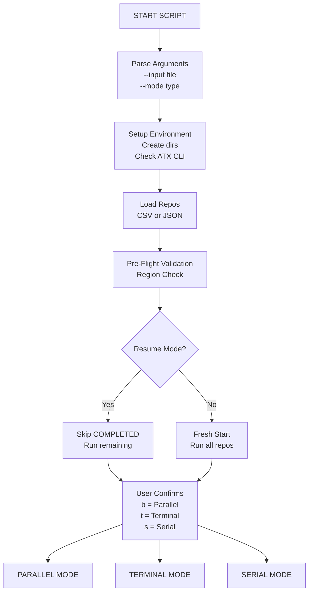
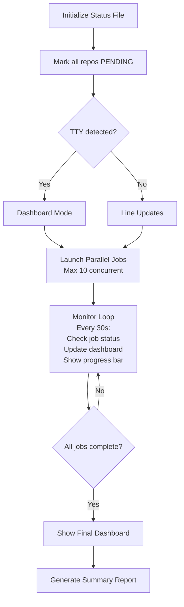
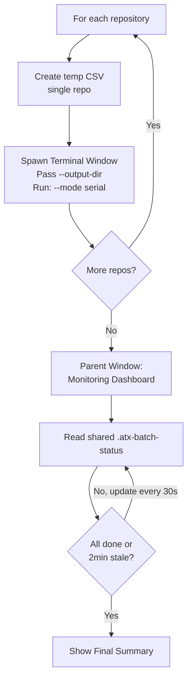
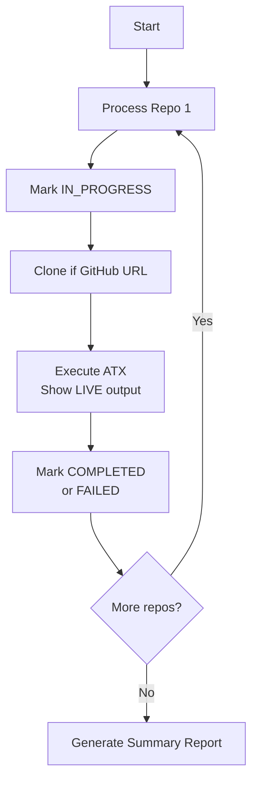
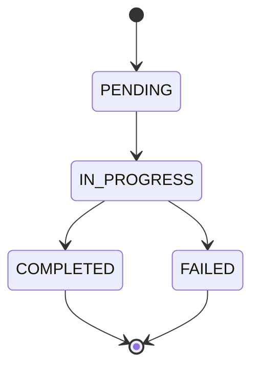
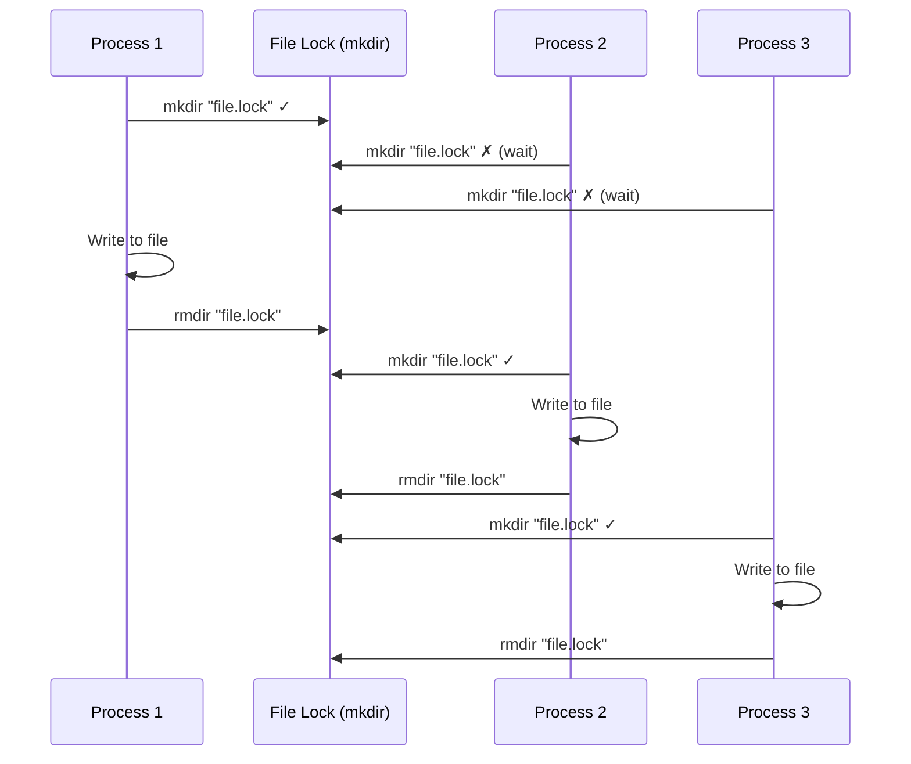
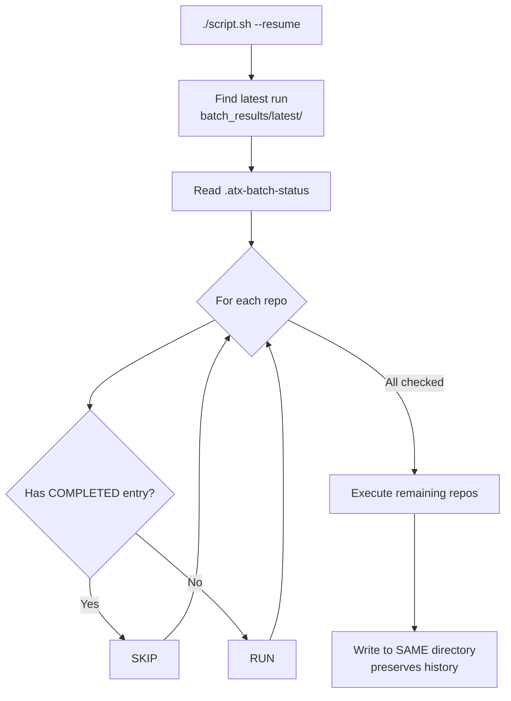
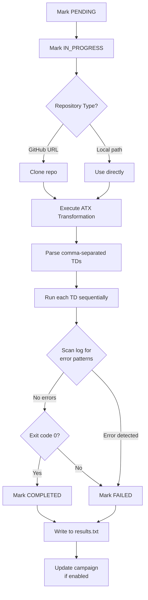
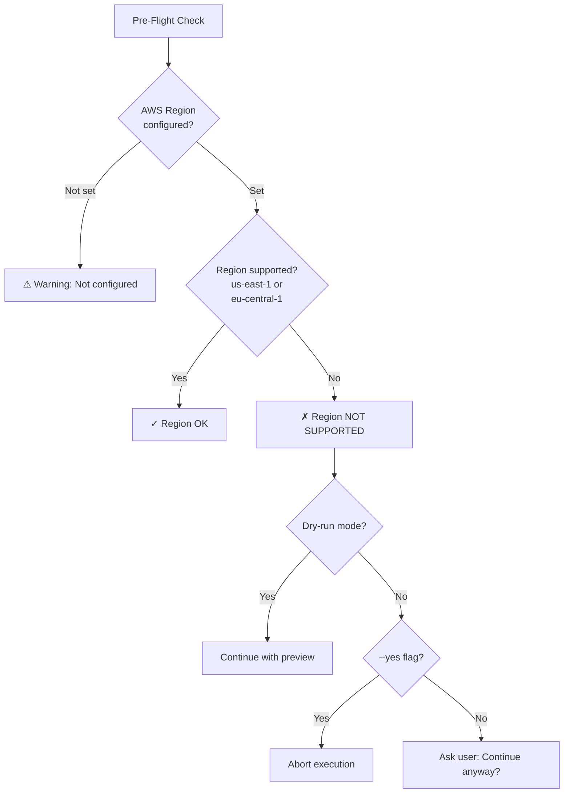
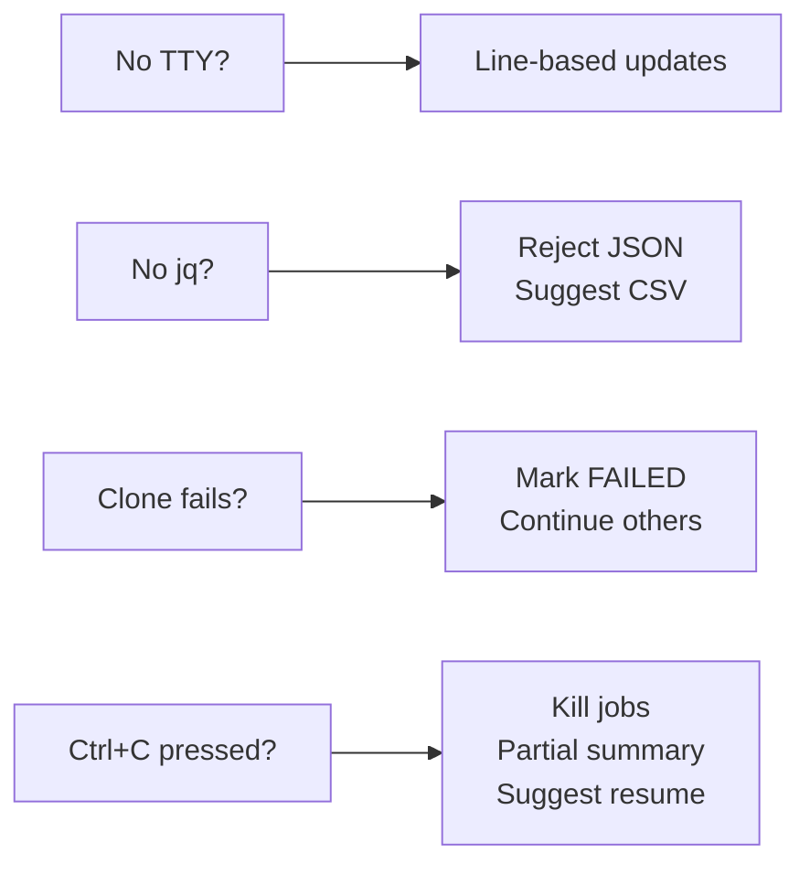

# ATX Custom Automation - System Workflow (v2.0)

## Execution Flow Overview



---

## Mode 1: Parallel Execution



**Dashboard View:**

```
════════════════════════════════════════════════════════════════
   🚀 BATCH EXECUTION IN PROGRESS
════════════════════════════════════════════════════════════════

  Repository                    Status         Duration
  ───────────────────────────── ────────────── ────────
  repo-1                        ⏳ IN_PROGRESS  2m 15s
  repo-2                        ✓  COMPLETED    1m 45s
  repo-3                        ⏸  PENDING      --

  Progress: ████░░░░░░░░░░░░░░░░ 1/3 (33%) | Elapsed: 2m 15s

  [Updates every 30s | Press Ctrl+C to interrupt]
════════════════════════════════════════════════════════════════
```

---

## Mode 2: Terminal Windows



**Each Spawned Terminal Shows:**

```
📥 Cloning repo-name...
✓ Cloned (2s)

🤖 Analyzing codebase...
📝 Generating transformation plan...
🔧 Applying changes...
✅ Transformation complete!

✓ Repository completed (1m 45s)
Press Enter to close...
```

---

## Mode 3: Serial Execution



**Enhanced Serial Output (Option A):**

```
════════════════════════════════════════════════════════════════
   🚀 [1/5] anotar-app-api
════════════════════════════════════════════════════════════════
  📍 Source: https://github.com/org/repo.git (GitHub HTTPS)
  🔄 TDs: 2 (AWS/nodejs-version-upgrade → AWS/early-access-codebase-analysis)
  🔨 Build: npm test

  📥 Cloning...                              ✓ (2s)
  ▶ TD 1/2: AWS/nodejs-version-upgrade       ✓ (12s)
  ▶ TD 2/2: AWS/early-access-codebase...     ✓ (20s)

  ✅ Completed (35s)
════════════════════════════════════════════════════════════════
```

---

## Status Lifecycle



| Status | Symbol | Color | Description |
|--------|--------|-------|-------------|
| PENDING | ⏸ | Cyan | Repo queued but not started |
| IN_PROGRESS | ⏳ | Yellow | ATX transformation running |
| COMPLETED | ✓ | Green | Transformation succeeded |
| FAILED | ✗ | Red | Error occurred |

---

## File Structure

```
batch_results/
├── 2026-02-24_21-00-00/              ← Timestamped run directory
│   ├── repo-1/
│   │   ├── execution.log             ← Full ATX output
│   │   └── td1_config.yaml           ← TD configuration
│   ├── repo-2/
│   │   └── execution.log
│   ├── .atx-batch-status             ← Status tracking (repo|status|time|duration)
│   ├── results.txt                   ← Machine-readable (status|repo|msg|dur)
│   ├── summary.log                   ← Human-readable summary
│   └── failed_repos.csv              ← Failed repos for retry
│
└── latest → 2026-02-24_21-00-00/     ← Symlink to most recent

batch_repos/                          ← Cloned GitHub repositories
└── repo-1/
└── repo-2/
```

---

## Concurrency Model (Parallel Mode)



All status updates are atomic and safe for parallel execution.

---

## Resume Functionality



---

## Per-Repository Execution Flow



---

## Pre-Flight Validation



---

## ATX Error Detection

After each TD execution, the script scans logs for known error patterns:

| Pattern | Cause |
|---------|-------|
| `AWS Transform is not available in region` | Wrong AWS region configured |
| `Authentication failed` | Invalid AWS credentials |
| `Transformation not found` | TD name doesn't exist |
| `Access Denied` | Insufficient permissions |
| `InvalidIdentityToken` / `ExpiredToken` | Expired AWS session |
| `Rate exceeded` | API throttling |

If detected, the TD is marked as **FAILED** even if ATX CLI exits with code 0.

---

## Execution Modes Comparison

| Feature | Parallel | Terminal | Serial | Batch |
|---------|----------|----------|--------|-------|
| Speed | ⚡⚡⚡ | ⚡⚡ | ⚡ | ⚡⚡ |
| Live Output | Dashboard | Per-window | Full | Full |
| Resource Usage | High | Medium | Low | Medium |
| Debugging Ease | Medium | High | High | Medium |
| Best For | Large batches | Watching live | Simple cases | Dependencies |
| Max Concurrent | 10 | All | 1 | Per batch |
| CI/CD Friendly | Yes | No | Yes | Yes |

---

## Error Handling



---

## Key Design Features

1. **Timestamped Isolation** — Each run gets unique folder, no overwrite prompts
2. **Dashboard Mode Flag** — Auto-detected: TTY + Parallel → Dashboard, otherwise full output
3. **Shared Output (Terminal Mode)** — Parent passes `--output-dir` to children, monitors shared status file
4. **Stale Detection** — No terminal updates for 2 minutes → Exit with resume suggestion
5. **Trust-All-Tools** — Enabled by default, override with `--no-trust-tools`
6. **Pre-Flight Validation** — Region check before execution starts
7. **Error Pattern Scanning** — Catches ATX issues that exit 0 but are actually failures

---

**Version:** 2.0
**Last Updated:** March 8, 2026
